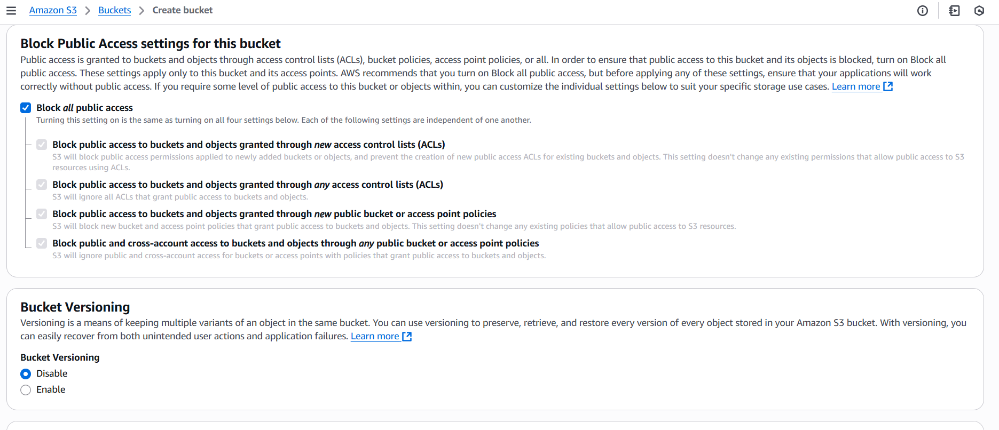
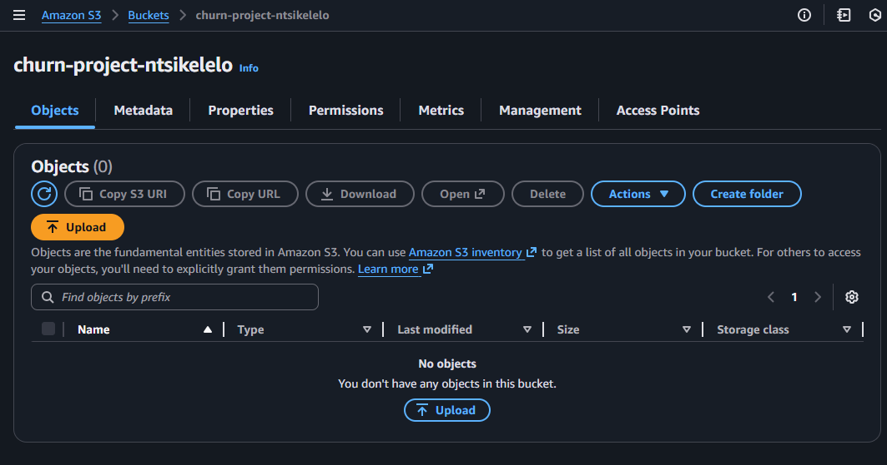
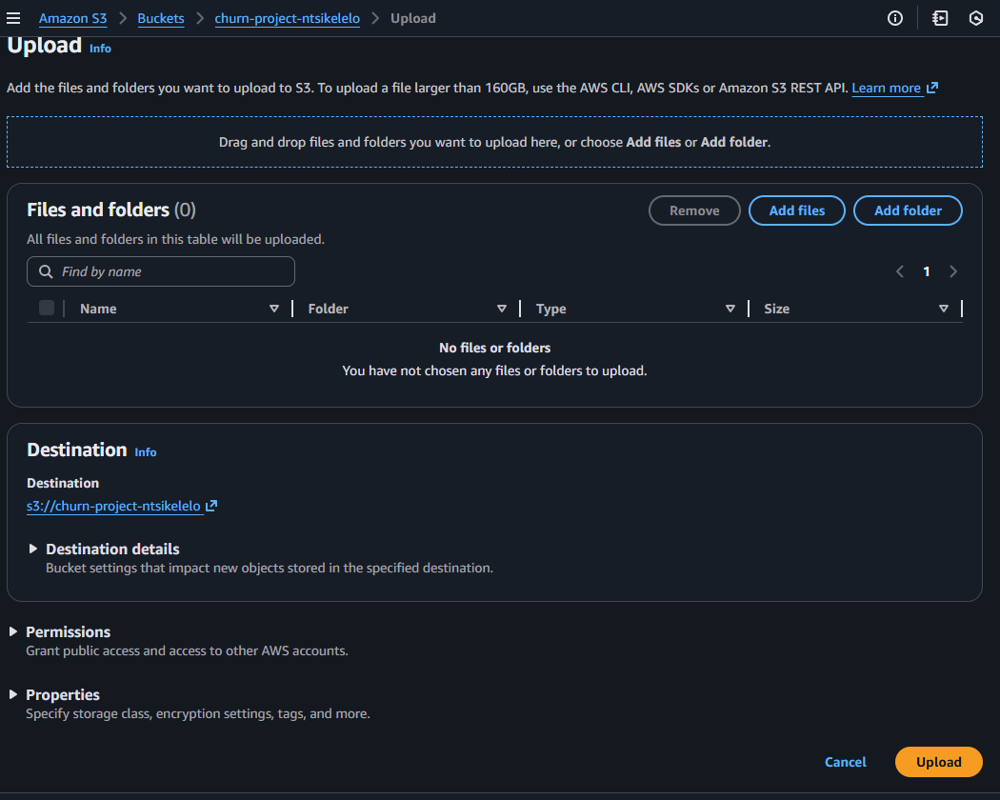

# End-to-End Customer Churn Prediction Piplenine on AWS
## Project Overview
Customer churn is a major business challenge - retaining existing customers is significantly cheaper than acquiring new ones.
This project builds an automated, end-to-end data engineering and data science pipeline to predict customer churn using AWS Free Tier services, Python and other libraries.

The system:
 - Ingest and stores data in amazon S3
 - Performs automated ETL and data validation
 - Conducts exploratory data analysis (EDA)
 - Trains and evaluates machine learning models

 The data:
 The data is collected from [scottdangelo github](https://github.com/IBM/telco-customer-churn-on-icp4d/blob/master/data/Telco-Customer-Churn.csv). The dataset is Telco customer churn from IBM, which simulates a company's customer churn. For more on the dataset [click here](https://www.ibm.com/docs/en/cognos-analytics/11.1.x?topic=samples-telco-customer-churn). This data can be downloaded and stored locally or can use a python function to download it.

## Setting up AWS environment
### Set up an IAM user
Open the AWS management console from your root user and create a user, by navigating to **IAM**. Navigate to **Users**. Choose create user and name the user what you want. Attach administrator access policy to the user. After the user has been created, click on the name of your user, underneath the **summary** click on **Create access key**. Choose **Command Line Interface (CLI)**, click **next** at the bottom of the screen. Add description for the tag, and click **Create access key**. You can download the generated access key on the next page in csv format. Keep this information safe as it allows a user access to your AWS resources via the command line.

For extra security, it is recommended to set up MFA device, which adds an additional layer of safety to keep your account safe.

### Download the AWS CLI
Navigate to [AWS CLI](https://docs.aws.amazon.com/cli/latest/userguide/getting-started-install.html) to install/update your AWS CLI. This is going to be helpful to access the AWS services via management console.

### Accessing the AWS resources programmatically
Open a terminal of your choice on your device. Run the command `aws configure`. This will prompt you to provide access key, copy and paste the `access key` and then the `secret access key` which is also in the downloaded csv file.
When prompted for the region, you can look for region names on the management console. In my case I used **us-east-1**

## Create S3 Buckets
Navigate to **S3** on the management console. Click **Create bucket**, Choose **General purpose** write out <bucket_name>, this name has to be univerally unique from any other bucket names in the AWS. Leave other setting the same on the page. 

You can uncheck the **Block all public access** section if you want your bucket to be seen by others. You can enable bucket versioning if you require the bucket to keep track of changes made inside it.

Click **Create bucket** to create the bucket.

## Upload data to S3 bucket

Click on the bucket created click `upload` button to get to import data into your bucket.

Click on `Add files`and select the customer_churn dataset or drag the dataset on to the indicated space . After uploading the dataset, click `Upload` at the bottom of the screen.
